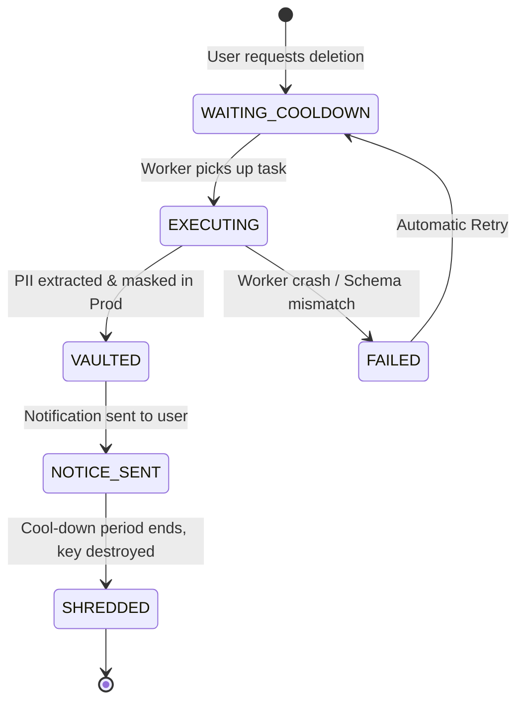

# Erasure Lifecycle and Shadow Mode

This document explains the step-by-step lifecycle of an erasure request and dives deep into **Shadow Mode**—the critical feature that builds trust between the Erasure Engine and your data engineers.

## The PII Lifecycle

When a user requests their data to be deleted, the engine does not immediately execute a `DELETE` statement. Instead, the request moves through a strict, auditable state machine.



1.  **`WAITING_COOLDOWN`**: The API Control Plane registers the request. It sits in a queue waiting for a Worker node.
2.  **`EXECUTING`**: A Worker claims a "lease" on the task. It begins extracting data from production databases according to the PII Manifest.
3.  **`VAULTED`**: 
    - The original PII is encrypted with a unique, per-user cryptographic key.
    - The encrypted blob is stored in the highly-secure Vault Database.
    - The production database is updated: the original PII is replaced with anonymized placeholders (`HMAC`, `NULL`, or `STATIC_MASK`).
    - *Why vault instead of delete?* To allow for a "cool-down" or grace period. If the request was malicious or accidental, the data can still be restored.
4.  **`NOTICE_SENT`**: The system triggers a webhook to your email service provider, alerting the user that their data is queued for permanent deletion.
5.  **`SHREDDED`**: Once the legal grace period expires (e.g., 30 days), the unique cryptographic key used to encrypt the vaulted data is securely destroyed. Without this key, the vaulted blob becomes cryptographically inaccessible. **The data is effectively destroyed.**

## Building Trust: Shadow Mode

The number one reason companies hesitate to implement automated erasure is fear. Running an automated script that modifies production databases carries significant risk. "What if it deletes the wrong thing? What if it breaks a foreign key and brings down the whole app?"

We built **Shadow Mode** to mitigate this operational risk.

### Shadow Mode Execution Flow

Shadow Mode allows you to run the entire Erasure Engine pipeline—including classification, extraction, and masking—**without actually altering your production database.**

1.  **The Transaction Begins**: The Worker node opens a standard SQL transaction (`BEGIN`) against your production database.
2.  **Data is Masked**: The Worker executes all the `UPDATE` and `DELETE` queries exactly as it would in production. It replaces names with hashes, nullifies emails, etc.
3.  **The Rollback**: At the very end of the process, instead of issuing a `COMMIT`, the Worker intentionally throws a `ShadowModeRollback` error and issues a `ROLLBACK`.
4.  **The Report**: The database state reverts to exactly how it was before the transaction started. The Worker then sends a detailed "Shadow Report" to the API.

### The Shadow Report

The Shadow Report acts as a dry-run receipt. It tells your data team exactly what *would* have happened if they ran it for real.

The report includes:
*   Which tables were touched.
*   Exactly how many rows would have been modified.
*   Which specific columns would have been masked.
*   Whether the transaction succeeded or if it encountered a database error (e.g., a foreign key constraint violation).

### Benefits of Shadow Mode

*   **Zero-Risk Testing**: You can test your PII configuration against real, live production data without any risk of data loss.
*   **Validation**: When you write a new schema mapping, you run it in Shadow Mode to verify that it functions as expected before deploying it to production.
*   **Audit Evidence**: Shadow Mode reports can be exported to show auditors that your erasure configuration is actively catching the correct data fields.

### Enabling Shadow Mode

Shadow Mode can be triggered on a per-request basis via the API, or globally configured for a specific environment (like Staging).

```json
// Example API Payload for a Shadow Mode execution
{
  "user_identifier": "user_12345",
  "shadow_mode": true
}
```

Shadow Mode allows developers to preview the engine's behavior against live data before committing real mutations.
