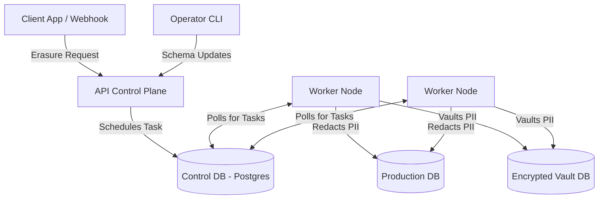

# Architecture and Overview

Welcome to the DPDP Erasure Engine architecture guide. This document provides a foundational understanding of what the engine does, why it exists, and how its components work together to provide cryptographically verified data erasure.

## Project Purpose and Context

In the modern regulatory landscape (GDPR, CCPA, India's DPDP Act), companies are legally required to delete user data upon request. However, "deleting" data in a complex, microservice-based architecture is incredibly difficult:

1.  **Data Sprawl**: User data isn't in one place. It is spread across primary databases, analytical replicas, caches, and third-party SaaS tools.
2.  **Referential Integrity**: Simply deleting a user record might break foreign key constraints, orphan associated data (like orders or invoices), and crash production applications.
3.  **Proof of Erasure**: When an auditor asks, "Did you delete this user?", simply showing a log line isn't enough. You need cryptographic evidence that the data is inaccessible.
4.  **Trust**: Data teams are hesitant to run automated deletion scripts on production databases. 

The **DPDP Erasure Engine** solves these problems. It is an enterprise-grade, "fail-closed" compliance system designed to execute data redaction safely, verify the erasure cryptographically, and provide operational confidence to data teams through "Shadow Mode."

## Core Capabilities

Instead of issuing raw `DELETE FROM users` queries, the Erasure Engine acts as a **Data Vault and Redaction Controller**. 

1.  **Classification**: It scans your database schemas to help identify Personally Identifiable Information (PII) using heuristic and rule-based introspection.
2.  **Vaulting**: It extracts sensitive PII from your production database and stores it securely in an encrypted internal vault.
3.  **Anonymization**: It replaces PII in your production database with referentially-intact placeholders (like `HMAC` hashes, `NULL` values, or `STATIC_MASK` strings). This allows the application to continue running without breaking foreign keys.
4.  **Shadow Mode**: It simulates the erasure process inside a database transaction, rolls it back, and reports what *would* have happened, allowing developers to inspect how the engine will interact with production before committing any changes.
5.  **Shredding**: When the legal retention period expires, it cryptographically shreds the encryption key holding the vaulted data, making the PII cryptographically inaccessible.

## System Architecture

The project is built around a robust, decoupled control-plane/data-plane architecture.

### 1. The API Control Plane (`apps/api`)
The API acts as the orchestrator. It does not touch your production databases directly.
- **Responsibilities**: Receiving erasure requests, managing the PII lifecycle state machine (Submitted -> Vaulted -> Shredded), serving the Operator dashboard, and distributing work to the Worker nodes.
- **Stack**: Hono.js running on Node/Bun, backed by a control database.

### 2. The Worker Data Plane (`apps/worker`)
The Workers operate inside your secure VPC and are the components that possess credentials to your production databases.
- **Responsibilities**: Executing data extraction, generating cryptographic hashes, updating production rows with masked data, and securely vaulting the original PII. 
- **Fault Tolerance**: Workers are designed to crash safely. They use a "lease" mechanism. If a Worker crashes mid-job, the API detects the expired lease and reassigns the job. The system is entirely idempotent.

### 3. The Operator CLI (`packages/cli`)
The CLI is the interface for operators.
- **Responsibilities**: Initializing the project, introspecting schemas, generating PII manifests (mapping where sensitive data lives), and syncing those manifests with the API.

## Data Retention vs. Data Erasure

A core conflict in compliance is balancing **Data Erasure** (the user's right to be forgotten) with **Data Retention** (legal requirements to keep records).

The Erasure Engine handles this via the **Manifest System**:
- If an email address is in the `users` table, you might want to mask it as `deleted_user_123@anonymized.local`.
- If that same email address is in the `invoices` table, you might have a strict retention policy prohibiting modification for 7 years.
- The Engine allows you to define policies per table and per column, providing a framework to comply with erasure laws without necessarily violating retention rules.

## Failover and Production Safety

"What happens if the API or Worker goes down? Will it corrupt my production data?"

**The system is designed to be Fail-Closed.**

1.  **Transaction Boundaries**: All database modifications within a single database are wrapped in strict `BEGIN...COMMIT` transactions. If the Worker loses power right before committing, the database rolls back the transaction.
2.  **Schema Hashing**: Before a Worker touches a database, it hashes the current schema structure and compares it to the Manifest. If a developer recently added a new column or dropped a table, the hash won't match, and the Worker will refuse to run. This prevents the Engine from acting on outdated assumptions.
3.  **Task Leasing**: As mentioned, if a Worker dies while processing a queue item, the API Control Plane re-queues it once the lease expires.

---

**Next Steps**:
* Want to know how we safely test this? Read the [Shadow Mode Guide](./erasure-lifecycle-and-shadow-mode.md).
* Want to understand how we detect PII? Read the [Introspector Guide](./introspector-and-pii-classification.md).
